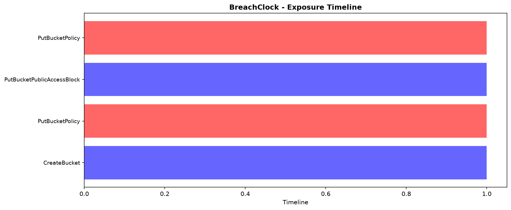

## Example Timeline Visualization

The chart shows:
- **Blue bars** - Administrative events (CreateBucket, PutBucketPolicy)
- **Red bars** - Public access configuration changes
- **Exposure window** - Time between becoming public and detection

## Architecture
1. **CloudTrail** captures all API calls on S3
2. **Script parses** PutBucketPolicy events to find exposure start time
3. **Timeline calculated** from exposure time to current moment
4. **Visualization generated** showing full event history
